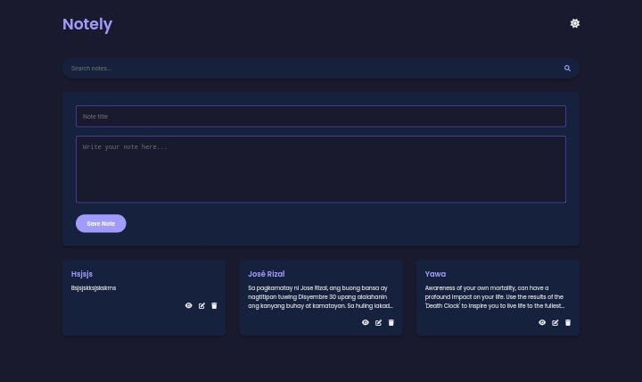
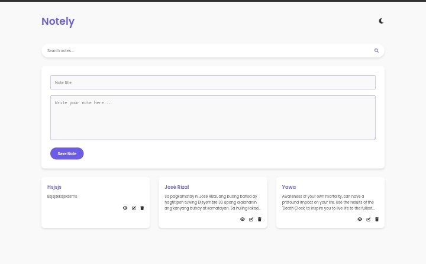
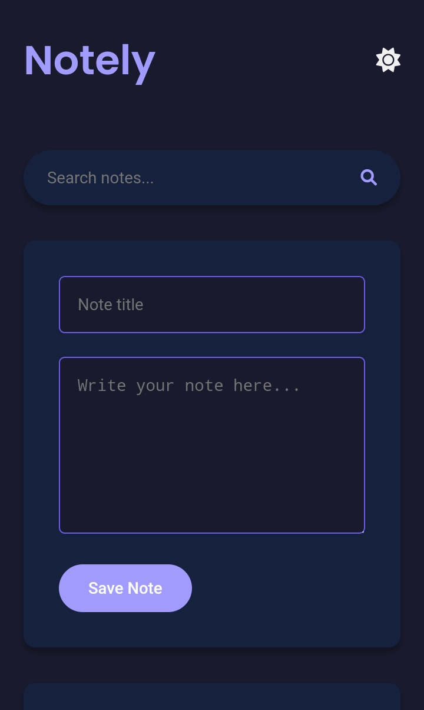

# Notely - Note Taking App

## Description
Notely is an intuitive note-taking application designed to help you organize and manage your notes efficiently. With features like real-time search, theme customization, and a user-friendly interface, Notely makes note-taking a breeze.

## Features
- Create, edit, and delete notes with ease
- Real-time search functionality to find notes quickly
- Toggle between light and dark themes for personalized experience
- Save notes securely within the application

## Screenshot




## Installation
1. Clone the repository:
    ```bash
    git clone https://github.com/JohnDev19/notely.git
    ```
2. Navigate to the project directory:
    ```bash
    cd notely
    ```
3. Open `index.html` in your preferred web browser.

## Usage
1. Enter a note title and content in the input fields.
2. Click "Save Note" to save your note.
3. Use the search bar to find notes by title or content.
4. Click on a note to view or edit its details.
5. Toggle between light and dark themes using the theme selector button in the note view modal.

## Contributing
Contributions to Notely are welcome! If you'd like to contribute:
1. Fork the repository.
2. Create a new branch (`git checkout -b feature-branch`).
3. Make your changes and commit them (`git commit -am 'Add new feature'`).
4. Push to the branch (`git push origin feature-branch`).
5. Create a new Pull Request.

## License
This project is licensed under the MIT License.
